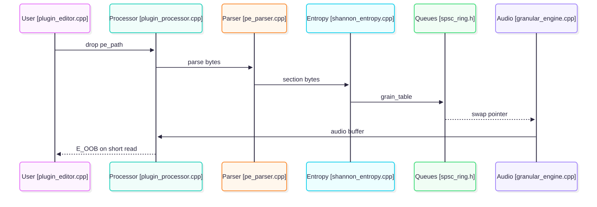

# Catlas

Catlas maps a messy codebase into `docs/atlas/` so a new reader can find entries, follow data, and trust the drawings. It inventories files, traces where data comes in and where it goes out, and draws the result in Mermaid so GitHub renders it. A local Edge pass checks alignment before you commit.

## When to use it

Use Catlas when you inherit code with no map: onboarding, pre refactor review, audit prep, or handoff docs. It fits repos where the README no longer matches the code. It writes the map from call sites with line numbers, not from memory.

Run it with `@catlas` in OpenCode, or call the subagents directly for large repos.

## Install

For OpenCode:

```text
.opencode/skills/catlas/SKILL.md
.opencode/agent/catlas-writer.md
.opencode/agent/catlas-diagrammer.md
.opencode/agent/catlas-reviewer.md
```

Copy this repo into those paths, or point `skills` at this repo URL in `opencode.json`:

```jsonc
{
  "$schema": "https://opencode.ai/config.json",
  "skills": ["https://github.com/9matesu/Catlas.git"]
}
```

For other agents that read `SKILL.md`, copy `SKILL.md`, `references/`, `templates/`, `scripts/`, and `agents/` beside it. Paths in the skill are relative to the `SKILL.md` folder.

Vendor the renderer once. Place a pinned `mermaid.min.js` at `third_party/mermaid.min.js` or `tools/` beside the skill. The file is not shipped here. Record the version in your atlas index.

## Requirements by OS

The diagrams, lint, and render pipeline run the same on Linux, macOS, and Windows. Linux is the reference platform for CI.

* Node 18 or newer with `npx` on PATH. Renders call pinned `@mermaid-js/mermaid-cli@12.0.0` with `tools/mermaid-config.json`, so output is byte identical across runs and machines.
* Python 3 with stdlib only for `scripts/mermaid-lint.py`.
* Git for `git hash-object`, which binds each check record to its diagram source.
* Network once per machine for the mermaid-cli download and its browser. After that renders run offline.

Linux and macOS render with `tools/render-mermaid.sh`. Windows renders with `tools/render-mermaid.ps1`. Make the shell script executable once: `chmod +x tools/render-mermaid.sh`.

## How a run goes

Scope, recon, inventory, entries and exits, flux graph, diagrams, visual QA, publish. Detail lives in `SKILL.md`. The short form:

1. Confirm root, languages, output folder, diagram budget. Default budget is 5 diagrams plus at most 2 detail diagrams.
2. List files grouped by role into `01-inventory.md`. Cap at 60 rows.
3. Trace every inbound and outbound to `path:line` with its data type into `assets/flux.json`.
4. Draw context, containers, L0, L1 detail, and one hot path sequence. Gray marks grouping nodes. White marks files with code.
5. Run `scripts/mermaid-lint.py`, render with `tools/render-mermaid.ps1`, read each PNG, fix the `.mmd` source. Repeat at most 3 rounds, then split the diagram.
6. Fill `01` through `04` plus `index.md`. Each claim cites `path:line`. Each diagram keeps its trace table.

Subagents for large repos: `catlas-writer` owns pages, `catlas-diagrammer` owns `.mmd` files, `catlas-reviewer` signs off read only. Small repos can run inline. Phases stay the same.

## Example case: Opcoda

Opcoda is a granular synth that turns PE binaries into sound. Pure C++20 core with no framework, JUCE only at the plugin edge. The worked pass lives in `examples/opcoda-pe-pipeline/` with 5 diagrams, `flux.json`, `inventory.csv`, and a trace table. Rendered with mermaid-cli 12.0.0.

### Where data enters and leaves



User files and the DAW host stay outside the boundary. Ingest takes the path, the core returns bytes, the engine swaps audio back. Short reads return `E_OOB` on the dotted edge.

### How bytes become audio


File bytes in `pe_parser.cpp` become float samples in `byte_to_sample.cpp`, feed entropy in `shannon_entropy.cpp`, cross the dual queue in `spsc_ring.h`, render in `granular_engine.cpp`, pass the DC blocker and limiter, and reach the host. One edge per data type, sources left, sinks right.

### The call order when debugging



Drop a file, ingest, parse, entropy, queue swap, render, audio back. Full set with containers and L1 PE parse detail in the example folder.

## Voice

All prose passes the humanizer pass. Tone is a senior engineer after reading the code: short sentences, exact paths, failure modes stated. Code blocks, commands, paths, and error codes stay verbatim. See `references/voice-guide.md`.

## Layout

```text
SKILL.md
agents/
references/
templates/
scripts/mermaid-lint.py
tools/render-mermaid.ps1
examples/opcoda-pe-pipeline/
```

## License

MIT. See `LICENSE`.
