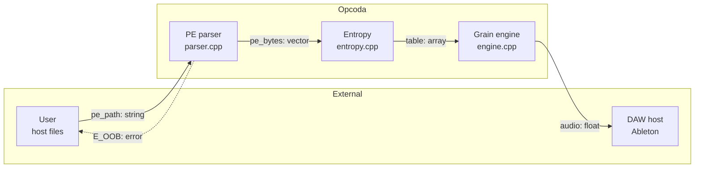
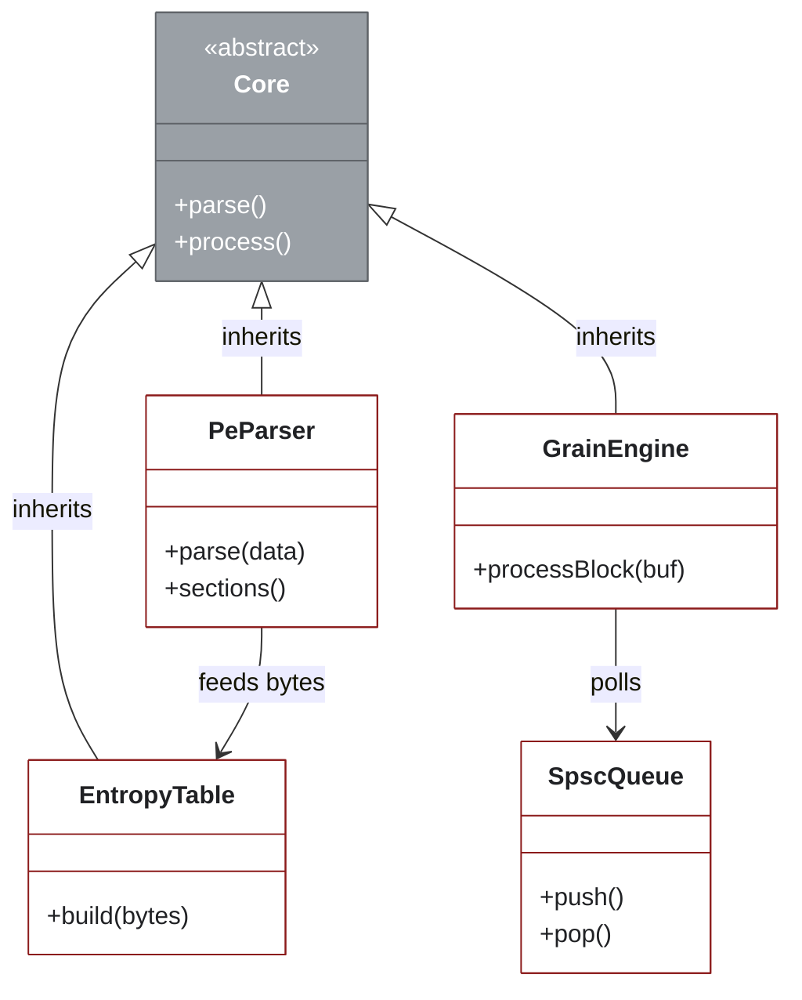
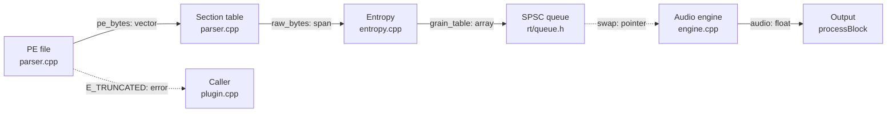
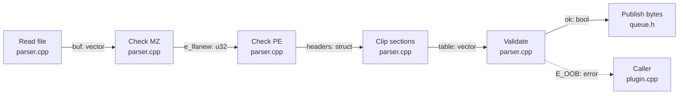
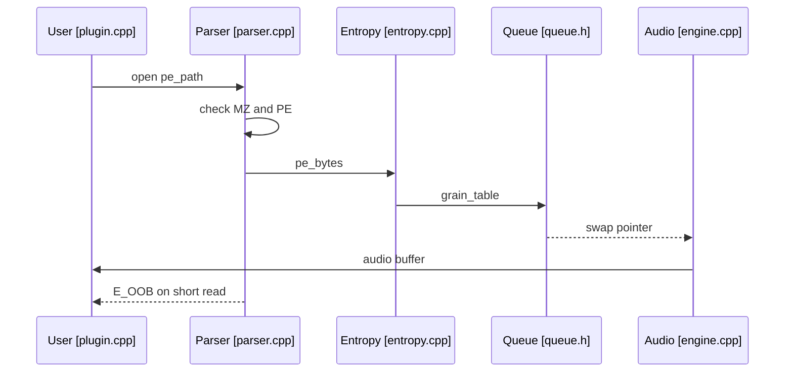

# Example: PE file to grain pipeline

This folder shows Catlas output on a small slice of Opcoda. The slice covers the path from a PE file on disk to audio in the host. It uses real call sites so you can check each edge.

## Diagrams

Render on GitHub from the `.mmd` source.

### Context

Source: `diagrams/context.mmd`.

### Containers

Source: `diagrams/containers.mmd`. Gray marks grouping nodes. White marks files with code.

### L0 data movement

Source: `diagrams/dataflow-l0.mmd`.

### L1 detail: PE parse

Source: `diagrams/dataflow-l1-pe-parse.mmd`.

### Hot path sequence

Source: `diagrams/sequence-hot-path.mmd`.

## Trace table

| edge | source | sink |
| ---- | ------ | ---- |
| pe_path: string | src/opcoda_core/pe/parser.cpp:88 | src/opcoda_core/pe/parser.cpp:104 |
| pe_bytes: vector | src/opcoda_core/pe/parser.cpp:104 | src/opcoda_core/entropy/table.cpp:61 |
| grain_table: array | src/opcoda_core/entropy/table.cpp:61 | src/opcoda_core/rt/queue.h:77 |
| audio: float | src/opcoda_core/dsp/engine.cpp:190 | src/opcoda_plugin/processor.cpp:212 |
| E_OOB: error | src/opcoda_core/pe/parser.cpp:151 | src/opcoda_plugin/processor.cpp:98 |

Machine form lives in `assets/flux.json`. File list lives in `assets/inventory.csv`.
