# Example: Opcoda PE file to grain pipeline

This folder shows Catlas output on Opcoda, a granular synth that turns PE binaries into sound. The slice covers the path from a file on disk to audio in the host. Each edge traces to a call site so you can check it.

## Context

Sources sit left, sinks right. The DAW host and the user files stay outside the repo boundary. Ingest in `plugin_processor.cpp` takes the path, hands bytes to the core, and swaps the result to audio. Typed errors return to the caller instead of failing silent.

Source: `diagrams/context.mmd`.

## Containers

Gray marks grouping nodes. White marks files with code. `PeParser`, `ShannonEntropy`, and `GrainEngine` share the core contract. The engine polls the SPSC ring. The parser feeds bytes to sampling.

Source: `diagrams/containers.mmd`.

## L0 data movement

Read left to right. File bytes in `pe_parser.cpp` become float samples in `byte_to_sample.cpp`, feed the entropy table in `shannon_entropy.cpp`, cross the dual queue in `spsc_ring.h`, render in `granular_engine.cpp`, pass the DC blocker and limiter, and reach the host from `plugin_processor.cpp`. Short reads return `E_OOB` on the dotted edge.

Source: `diagrams/dataflow-l0.mmd`.

## L1 detail: PE parse

The parse order matters. MZ check, then PE signature at `e_lfanew`, then COFF header 4 bytes later, then `SizeOfRawData` clipped to what the file holds, then section count capped at 96. Anything past the buffer returns `E_OOB`.

Source: `diagrams/dataflow-l1-pe-parse.mmd`.

## Hot path sequence

The path you hit first when debugging: drop a file in `plugin_editor.cpp`, ingest in `plugin_processor.cpp`, parse, entropy, queue swap, render, audio back. Participants carry file names.

Source: `diagrams/sequence-hot-path.mmd`.

## Trace table

| edge | source | sink |
| ---- | ------ | ---- |
| pe_path: string | src/opcoda_core/pe/pe_parser.cpp:88 | src/opcoda_core/pe/pe_parser.cpp:104 |
| pe_bytes: vector | src/opcoda_core/pe/pe_parser.cpp:104 | src/opcoda_core/entropy/shannon_entropy.cpp:61 |
| grain_table: array | src/opcoda_core/entropy/shannon_entropy.cpp:61 | src/opcoda_core/rt/spsc_ring.h:77 |
| audio: float -1 dBFS | src/opcoda_core/dsp/limiter.cpp:63 | src/opcoda_plugin/source/plugin_processor.cpp:212 |
| E_OOB: error | src/opcoda_core/pe/pe_parser.cpp:151 | src/opcoda_plugin/source/plugin_processor.cpp:98 |

Machine form lives in `assets/flux.json`. File list lives in `assets/inventory.csv`. Line numbers track Opcoda at the commit recorded in the root README.
